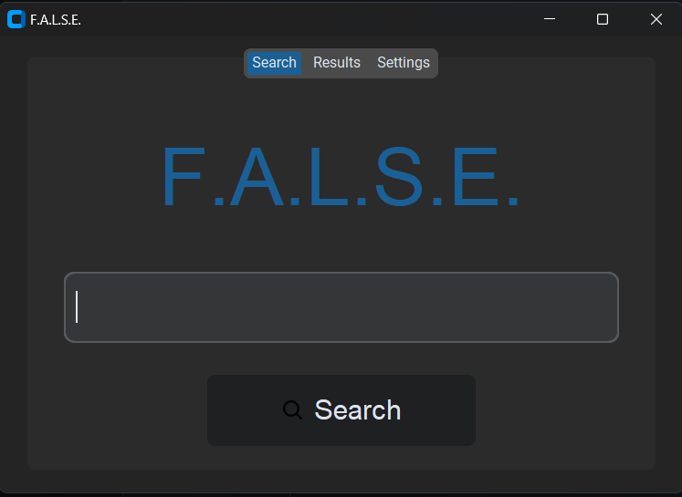
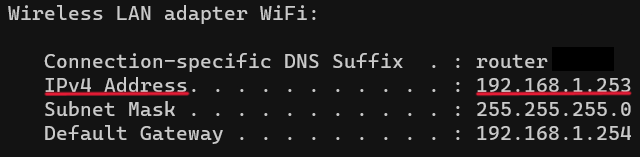

# Installation guide (for windows)

* Download [Docker](https://www.docker.com/products/docker-desktop/)
* Install (follow the Wizard) and open Docker
* Open a terminal from inside the project-folder and run:
    * ```docker build --tag false_image:latest .``` (to build the Docker image)
* Download [Xming X Server for Windows](https://sourceforge.net/projects/xming/)
* Install Xming (follow the Wizard) ([XQuartz](https://www.xquartz.org/) will probably work for Linux/Mac)
* Open "Command Prompt" and run ```ipconfig```
* Copy the "IPv4 Address" under the WiFi section <br>

* Open XLaunch (which was installed along side Xming)
    * Choose "Multiple Windows"
    * Choose "Start No Client"
    * Check "No Access Control"
    * Finish

* Open terminal from within the folder containing the DockerFile and run:
    * ```docker run -it -v .:/usr/src/ --rm -e DISPLAY=DISPLAY_ENV:0.0 --network="host" --name false false_image``` (where DISPLAY_ENV the "IPv4 Address")

## How much time/storage it will take

* The storage requirement for the Docker Desktop app is around 3GB
* The construction of the "false_image" is anticipated to take approximately 15 to 20 minutes, with a storage consumption of about 3.5GB

## Command Explanation:
* ```-it```, interactive
* ```-v```, mount a system folder from the host before the colon, to a folder inside the Docker container after the colon
* ```-rm```, removes the container after it stops running
* ```-e DISPLAY=DISPLAY_ENV:0.0```, sets the display environmental variable of the docker as the "IPv4Address":0.0
* ```--network="host"```, the container will share the network namespace with the host machine
* ```--name container_name image_name```

## Useful commands:

* ```docker start -i false```, to start the Container again
*  ```docker stop false```, to stop the Container
* ```docker rm -f false```, to forcefully remove the Container
* ```docker rmi -f false_image```, to forcefully remove the false_image
* ```docker exec -it false <command_to_execute_inside_the_container>```, to run commands from inside the Docker container
<br><br>